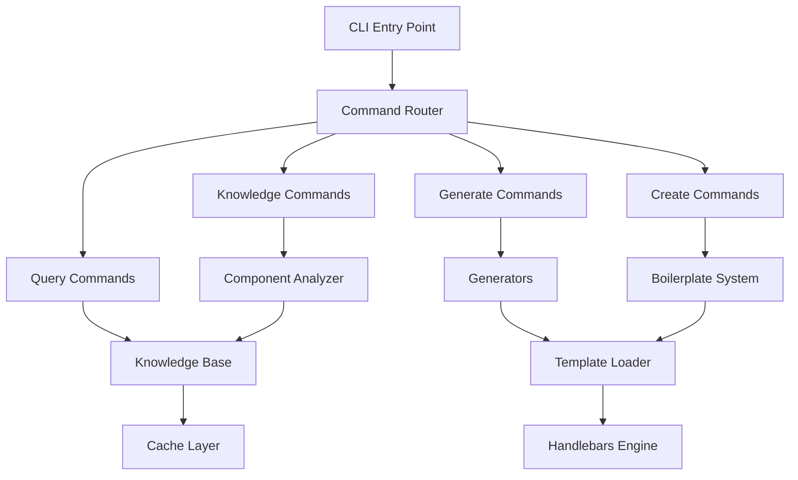

# Archbase CLI - Architecture Guide

> **Guia técnico da arquitetura e design decisions**

## 🏗️ Visão Geral Arquitetural

### Problema Central
- **Challenge**: IAs não conhecem bibliotecas customizadas (Archbase React)
- **Solution**: CLI que fornece contexto estruturado + geração baseada em templates

### Design Principles
1. **AI-First**: Todas as saídas são estruturadas para consumo por IA
2. **Template-Driven**: Geração baseada em templates testados e validados
3. **Knowledge-Based**: Sistema híbrido (auto + manual) de conhecimento
4. **Extensible**: Plugin system e templates customizáveis
5. **Type-Safe**: TypeScript first com validação completa

## 🎯 Arquitetura de Alto Nível



## 📦 Módulos Core

### 1. Command System
```typescript
// commands/
├── query.ts         # Consulta de conhecimento
├── generate.ts      # Geração de código
├── create.ts        # Scaffolding de projetos
└── knowledge.ts     # Gerenciamento da base
```

**Responsabilidades:**
- Parsing de argumentos CLI
- Validação de parâmetros
- Orquestração dos geradores
- Output formatado para usuário

### 2. Generation Engine
```typescript
// generators/
├── FormGenerator.ts      # Formulários
├── ViewGenerator.ts      # Views (List, CRUD, Dashboard)
├── PageGenerator.ts      # Páginas completas
├── ComponentGenerator.ts # Componentes individuais
└── BoilerplateGenerator.ts # Projetos completos
```

**Pattern: Strategy + Factory**
```typescript
interface Generator {
  generate(name: string, config: GenerationConfig): Promise<GenerationResult>;
}

class GeneratorFactory {
  static create(type: string): Generator {
    switch(type) {
      case 'form': return new FormGenerator();
      case 'view': return new ViewGenerator();
      // ...
    }
  }
}
```

### 3. Template System
```typescript
// utils/template-loader.ts
class TemplateLoader {
  private cache: Map<string, HandlebarsTemplateDelegate>;
  
  async loadTemplate(category: string, name: string): Promise<Template>;
  registerHelpers(): void;
  clearCache(): void;
}
```

**Features:**
- **Caching**: Templates compilados em memória
- **Helpers**: Funções utilitárias Handlebars
- **Fallback**: Templates inline como backup
- **Hot Reload**: Reload automático em dev mode

### 4. Knowledge System
```typescript
// knowledge/KnowledgeBase.ts
class KnowledgeBase {
  private components: Map<string, ComponentInfo>;
  private patterns: Map<string, PatternInfo>;
  
  async searchComponents(query: string): Promise<ComponentInfo[]>;
  async getComponent(name: string): Promise<ComponentInfo>;
  async addComponent(info: ComponentInfo): Promise<void>;
}
```

**Hybrid Approach:**
- **Automatic**: AST analysis via Babel
- **Manual**: Curated descriptions and examples
- **Cached**: Performance-optimized storage
- **Versioned**: Migration support

### 5. Component Analyzer
```typescript
// analyzers/ComponentAnalyzer.ts
class ComponentAnalyzer {
  async analyzeFile(filePath: string): Promise<ComponentAnalysis>;
  private parseAST(code: string): Node;
  private extractProps(ast: Node): PropDefinition[];
  private detectDataSourceUsage(ast: Node): DataSourceInfo;
}
```

**AST Analysis Capabilities:**
- Props extraction with TypeScript types
- DataSource V1/V2 detection
- Hook usage analysis
- Complexity calculation
- Dependency mapping

## 🔧 Design Patterns

### 1. Command Pattern
```typescript
interface Command {
  execute(args: string[]): Promise<void>;
}

class QueryCommand implements Command {
  async execute(args: string[]): Promise<void> {
    // Implementation
  }
}
```

### 2. Template Method Pattern
```typescript
abstract class BaseGenerator {
  async generate(name: string, config: Config): Promise<Result> {
    this.validate(config);
    const context = this.buildContext(name, config);
    const template = await this.getTemplate(config.template);
    const content = this.renderTemplate(template, context);
    return this.writeFiles(content, config.output);
  }
  
  protected abstract buildContext(name: string, config: Config): Context;
  protected abstract getTemplate(templateName: string): Promise<Template>;
}
```

### 3. Strategy Pattern
```typescript
interface ValidationStrategy {
  validate(fields: FieldDefinition[]): ValidationSchema;
}

class YupValidationStrategy implements ValidationStrategy {
  validate(fields: FieldDefinition[]): ValidationSchema {
    // Yup-specific validation
  }
}

class ZodValidationStrategy implements ValidationStrategy {
  validate(fields: FieldDefinition[]): ValidationSchema {
    // Zod-specific validation
  }
}
```

### 4. Observer Pattern
```typescript
interface GenerationObserver {
  onGenerationStart(event: GenerationEvent): void;
  onGenerationComplete(event: GenerationEvent): void;
  onGenerationError(event: GenerationEvent): void;
}

class ProgressObserver implements GenerationObserver {
  onGenerationStart(event: GenerationEvent): void {
    this.spinner.start(`Generating ${event.type}...`);
  }
}
```

## 🧠 Knowledge Architecture

### Data Model
```typescript
interface ComponentInfo {
  name: string;
  category: string;
  description: string;
  props: Record<string, PropDefinition>;
  examples: ExampleInfo[];
  patterns: string[];
  aiHints: string[];
  complexity: 'low' | 'medium' | 'high';
  hasDataSource: boolean;
  hasV1V2Compatibility: boolean;
}

interface PatternInfo {
  name: string;
  title: string;
  description: string;
  components: string[];
  template: string;
  complexity: 'low' | 'medium' | 'high';
  tags: string[];
}
```

### Storage Strategy
```typescript
class KnowledgeStorage {
  // Local cache for performance
  private cache: Map<string, any>;
  
  // File-based persistence
  private filePath: string;
  
  // Remote sync capability (future)
  private remoteUrl?: string;
  
  async load(): Promise<void>;
  async save(): Promise<void>;
  async sync(): Promise<void>;
}
```

### Search & Indexing
```typescript
class KnowledgeSearchEngine {
  private index: SearchIndex;
  
  async searchComponents(query: string): Promise<ComponentInfo[]> {
    // Fuzzy search implementation
    // Category filtering
    // Tag-based filtering
    // Relevance scoring
  }
  
  async suggestComponents(intent: string): Promise<SuggestionResult> {
    // Intent analysis
    // Pattern matching
    // AI-driven suggestions
  }
}
```

## 🎨 Template Architecture

### Template Hierarchy
```
templates/
├── base/              # Base templates
│   ├── component.hbs  # Generic component
│   ├── page.hbs       # Generic page
│   └── common.hbs     # Shared partials
├── forms/             # Form-specific
│   ├── basic.hbs
│   ├── validation.hbs
│   └── wizard.hbs
├── views/             # View-specific
│   ├── list.hbs
│   ├── crud.hbs
│   └── dashboard.hbs
└── partials/          # Reusable pieces
    ├── imports.hbs
    ├── interfaces.hbs
    └── tests.hbs
```

### Template Context
```typescript
interface TemplateContext {
  // Basic info
  componentName: string;
  entityName?: string;
  
  // Configuration
  typescript: boolean;
  withTests: boolean;
  withStories: boolean;
  
  // Data structures
  props: PropDefinition[];
  fields: FieldDefinition[];
  imports: string[];
  
  // Features
  features: string[];
  validation?: ValidationConfig;
  
  // Metadata
  author?: string;
  license?: string;
  version?: string;
}
```

### Custom Helpers
```javascript
// Template helpers registration
Handlebars.registerHelper('eq', (a, b) => a === b);
Handlebars.registerHelper('includes', (array, value) => array.includes(value));
Handlebars.registerHelper('capitalize', str => str.charAt(0).toUpperCase() + str.slice(1));
Handlebars.registerHelper('typeToTS', type => mapJSTypeToTS(type));
```

## 🚀 Boilerplate Architecture

### Boilerplate Structure
```
boilerplate/
├── config.json       # Metadata & configuration
├── template/          # Project template files
│   ├── package.json.hbs
│   ├── src/
│   └── ...
├── hooks/             # Lifecycle hooks
│   ├── pre-install.js
│   ├── post-install.js
│   └── validation.js
├── docs/              # Documentation
└── assets/            # Static assets
```

### Configuration Schema
```typescript
interface BoilerplateConfig {
  // Metadata
  name: string;
  version: string;
  description: string;
  category: string;
  tags: string[];
  
  // Requirements
  requirements: {
    node: string;
    npm: string;
    [key: string]: string;
  };
  
  // Features
  features: Record<string, FeatureConfig>;
  
  // User prompts
  prompts: PromptConfig[];
  
  // Dependencies
  dependencies: Record<string, string>;
  devDependencies: Record<string, string>;
  
  // Customization
  customization: {
    theme?: ThemeConfig;
    branding?: BrandingConfig;
  };
}
```

### Hook System
```typescript
interface BoilerplateHook {
  (context: HookContext): Promise<void>;
}

interface HookContext {
  projectName: string;
  answers: Record<string, any>;
  outputPath: string;
  config: BoilerplateConfig;
}

// Hook execution pipeline
class HookRunner {
  async runHooks(boilerplateName: string, context: HookContext): Promise<void> {
    await this.runHook('pre-install', context);
    await this.generateFiles(context);
    await this.runHook('post-install', context);
  }
}
```

## 🔌 Plugin System (Future)

### Plugin Interface
```typescript
interface ArchbasePlugin {
  name: string;
  version: string;
  
  // Extension points
  commands?: Command[];
  generators?: Generator[];
  templates?: TemplateProvider[];
  hooks?: HookProvider[];
  
  // Lifecycle
  activate(context: PluginContext): Promise<void>;
  deactivate(): Promise<void>;
}
```

### Extension Points
```typescript
class PluginManager {
  private plugins: Map<string, ArchbasePlugin>;
  
  async loadPlugin(pluginPath: string): Promise<void>;
  async registerCommand(command: Command): Promise<void>;
  async registerGenerator(generator: Generator): Promise<void>;
  async registerTemplate(template: TemplateProvider): Promise<void>;
}
```

## 🎭 AI Integration Architecture

### AI-Friendly Output
```typescript
interface AIResponse {
  intent: string;
  confidence: number;
  recommendations: {
    components: string[];
    patterns: string[];
    boilerplates: string[];
    suggestedCommand: string;
  };
  context: {
    commonPitfalls: string[];
    bestPractices: string[];
    examples: string[];
  };
}
```

### Intent Recognition
```typescript
class IntentAnalyzer {
  async analyzeIntent(query: string): Promise<Intent> {
    // NLP processing
    // Pattern matching
    // Confidence scoring
  }
  
  async suggestComponents(intent: Intent): Promise<ComponentSuggestion[]> {
    // Component relevance scoring
    // Pattern matching
    // Usage frequency
  }
}
```

### Context Provision
```typescript
class AIContextProvider {
  async getComponentContext(componentName: string): Promise<AIComponentContext> {
    return {
      component: await this.kb.getComponent(componentName),
      usage: await this.getUsageExamples(componentName),
      patterns: await this.getRelatedPatterns(componentName),
      hints: await this.getAIHints(componentName)
    };
  }
}
```

## 🔄 Performance Considerations

### Caching Strategy
```typescript
class CacheManager {
  // Template compilation cache
  private templateCache: LRUCache<string, CompiledTemplate>;
  
  // Knowledge base cache
  private knowledgeCache: LRUCache<string, ComponentInfo>;
  
  // File system cache
  private fsCache: LRUCache<string, Buffer>;
  
  async warmup(): Promise<void> {
    // Pre-load critical templates
    // Pre-compile knowledge base
    // Pre-cache common patterns
  }
}
```

### Lazy Loading
```typescript
class LazyLoader {
  private generators = new Map<string, () => Promise<Generator>>();
  
  registerGenerator(type: string, factory: () => Promise<Generator>): void {
    this.generators.set(type, factory);
  }
  
  async getGenerator(type: string): Promise<Generator> {
    const factory = this.generators.get(type);
    return factory ? await factory() : null;
  }
}
```

### Streaming & Progress
```typescript
class StreamingGenerator {
  async *generateFiles(config: GenerationConfig): AsyncIterableIterator<GeneratedFile> {
    for (const file of this.getFilesToGenerate(config)) {
      yield await this.generateFile(file);
    }
  }
}
```

## 🧪 Testing Architecture

### Testing Strategy
```typescript
// Unit tests for core logic
describe('FormGenerator', () => {
  it('should generate basic form with validation');
  it('should handle complex field types');
  it('should support custom templates');
});

// Integration tests for CLI commands
describe('CLI Integration', () => {
  it('should generate complete project');
  it('should handle invalid inputs gracefully');
});

// Template tests
describe('Templates', () => {
  it('should render valid TypeScript');
  it('should include all required imports');
});
```

### Mock Strategy
```typescript
class MockKnowledgeBase implements KnowledgeBase {
  async getComponent(name: string): Promise<ComponentInfo> {
    return mockComponents[name];
  }
}

class MockFileSystem {
  private files = new Map<string, string>();
  
  async writeFile(path: string, content: string): Promise<void> {
    this.files.set(path, content);
  }
}
```

## 📊 Monitoring & Analytics

### Metrics Collection
```typescript
interface UsageMetrics {
  commandUsage: Record<string, number>;
  generatorUsage: Record<string, number>;
  templateUsage: Record<string, number>;
  errorRates: Record<string, number>;
  performanceMetrics: PerformanceData[];
}

class MetricsCollector {
  async trackCommand(command: string, duration: number): Promise<void>;
  async trackError(error: Error, context: string): Promise<void>;
  async trackGeneration(type: string, success: boolean): Promise<void>;
}
```

### Error Tracking
```typescript
class ErrorTracker {
  async reportError(error: Error, context: ErrorContext): Promise<void> {
    // Sanitize sensitive data
    // Aggregate similar errors
    // Report to monitoring service
  }
}
```

## 🔒 Security Considerations

### Template Security
```typescript
class TemplateSanitizer {
  sanitizeTemplate(template: string): string {
    // Remove dangerous helpers
    // Validate expressions
    // Escape user input
  }
}
```

### File System Security
```typescript
class SecureFileWriter {
  async writeFile(path: string, content: string): Promise<void> {
    // Validate path traversal
    // Check file permissions
    // Sanitize content
  }
}
```

---

**📝 Nota**: Esta arquitetura representa o estado atual (v0.1.0) e a visão futura do Archbase CLI. Algumas funcionalidades (como plugin system) estão em desenvolvimento.