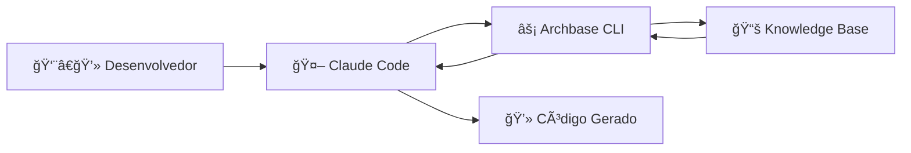

# 🤖 Archbase CLI + Claude Code - Guia de Integração

## 🯠**Visão Geral da Integração**

A integração entre Archbase CLI e Claude Code resolve o problema fundamental: **Claude Code não conhece bibliotecas customizadas**. O CLI atua como uma "ponte de conhecimento" que fornece contexto estruturado sobre os componentes Archbase para a IA.

---

## 🔄 **Fluxo de Trabalho Integrado**

### **1. Desenvolvedor → Claude Code → CLI → Código**



### **Passo a Passo:**
1. **Desenvolvedor** faz pergunta para Claude Code
2. **Claude Code** consulta o Archbase CLI para obter contexto
3. **CLI** retorna informações estruturadas sobre componentes
4. **Claude Code** usa esse contexto para gerar código inteligente
5. **Código** é gerado seguindo padrões Archbase automaticamente

---

## 💬 **Exemplos Práticos de Conversas**

### **🯠Cenário 1: Criando um Formulário de Usuário**

#### **Conversa com Claude Code:**
```
👨â€ğŸ’» Desenvolvedor: "Preciso criar um formulário de cadastro de usuário com nome, email e telefone usando Archbase React V3"

🤖 Claude Code: "Vou consultar o CLI para obter informações sobre os componentes de formulário do Archbase..."

[Claude executa internamente: archbase query component ArchbaseFormTemplate]
[Claude executa internamente: archbase query component ArchbaseEdit]

🤖 Claude Code: "Baseado no conhecimento do Archbase V3, vou criar um formulário usando ArchbaseFormTemplate com DataSource V2. Aqui está o código:"

```typescript
import React, { useCallback } from 'react';
import { 
  useArchbaseRemoteDataSource
} from '@archbase/data';
import {
  ArchbaseEdit
} from '@archbase/components';
import {
  ArchbaseFormTemplate
} from '@archbase/template';
import { UserDto } from '../domain/UserDto';
import { UserRemoteService } from '../service/UserRemoteService';

interface UserFormProps {
  userId?: string;
}

export function UserForm({ userId }: UserFormProps) {
  const { dataSource, isLoading, error } = useArchbaseRemoteDataSource<UserDto, string>({
    name: 'dsUser',
    label: 'User',
    service: UserRemoteService,
    pageSize: 50,
    loadOnStart: true,
    id: userId,
  });

  const handleAfterSave = useCallback((entity: UserDto) => {
    // Navigate back to list view
  }, []);

  if (isLoading) return <div>Carregando...</div>;
  if (error) return <div>Erro: {error.message}</div>;

  return (
    <ArchbaseFormTemplate
      title="Cadastro de Usuário"
      dataSource={dataSource}
      onAfterSave={handleAfterSave}
    >
      <ArchbaseEdit
        label="Nome"
        dataSource={dataSource}
        dataField="name"
        required
        placeholder="Digite o nome completo"
      />
      
      <ArchbaseEdit
        label="E-mail"
        dataSource={dataSource}
        dataField="email"
        type="email"
        required
        placeholder="usuario@exemplo.com"
      />
      
      <ArchbaseEdit
        label="Telefone"
        dataSource={dataSource}
        dataField="phone"
        placeholder="(11) 99999-9999"
      />
    </ArchbaseFormTemplate>
  );
}
```

👨â€ğŸ’» Desenvolvedor: "Perfeito! Como adiciono validação a este formulário?"

🤖 Claude Code: "Vou consultar as opções de validação disponíveis..."

[Claude executa: archbase query component ArchbaseValidator]

🤖 Claude Code: "Adicione validação usando yup. Aqui está a versão atualizada:"

```typescript
import * as yup from 'yup';

const validator = yup.object({
  name: yup.string().required('Nome é obrigatório'),
  email: yup.string().email('E-mail inválido').required('E-mail é obrigatório'),
  phone: yup.string().matches(/^\(\d{2}\) \d{4,5}-\d{4}$/, 'Formato inválido')
});

// Adicione ao useArchbaseRemoteDataSource:
const { dataSource, isLoading, error } = useArchbaseRemoteDataSource<UserDto, string>({
  name: 'dsUser',
  label: 'User',
  service: UserRemoteService,
  validator, // ↠Adicione aqui
  pageSize: 50,
  loadOnStart: true,
  id: userId,
});
```
```

---

### **🯠Cenário 2: Criando uma Lista CRUD**

#### **Conversa com Claude Code:**
```
👨â€ğŸ’» Desenvolvedor: "Agora preciso de uma lista para gerenciar esses usuários, com funcionalidades de CRUD e filtros"

🤖 Claude Code: "Vou consultar os componentes de grid disponíveis..."

[Claude executa: archbase query component ArchbaseDataGrid]
[Claude executa: archbase query component ArchbaseDataGridColumn]

🤖 Claude Code: "Baseado no padrão powerview-admin do Archbase, aqui está uma lista CRUD completa:"

```typescript
import React, { useMemo, useRef, useState, useCallback } from 'react';
import { 
  Paper, Group, Button, ActionIcon 
} from '@mantine/core';
import {
  IconPlus, IconEdit, IconTrash, IconEye
} from '@tabler/icons-react';
import {
  ArchbaseDataGrid,
  ArchbaseDataGridColumn,
  Columns
} from '@archbase/components';
import {
  useArchbaseRemoteDataSource
} from '@archbase/data';
import {
  useArchbaseNavigateParams,
  useArchbaseGetLoggedUser
} from '@archbase/core';

export function UserListView() {
  const loggedUser = useArchbaseGetLoggedUser();
  const navigate = useArchbaseNavigateParams();
  const gridRef = useRef<any>(null);

  const { dataSource, isLoading, error } = useArchbaseRemoteDataSource<UserDto, string>({
    name: 'dsUserList',
    service: UserRemoteService,
    pageSize: 25,
    loadOnStart: true,
  });

  const handleAdd = useCallback(() => {
    navigate('/users/new');
  }, [navigate]);

  const handleEdit = useCallback(() => {
    const record = dataSource.getCurrentRecord();
    if (record) {
      navigate(`/users/${record.id}`);
    }
  }, [dataSource, navigate]);

  const buildRowActions = useCallback((row: UserDto) => {
    return (
      <Group gap={4} wrap="nowrap">
        <ActionIcon variant="transparent" color="blue" onClick={() => {
          dataSource.gotoRecordByData(row);
          handleEdit();
        }}>
          <IconEdit size={20} />
        </ActionIcon>
        <ActionIcon variant="transparent" color="red" onClick={() => {
          dataSource.gotoRecordByData(row);
          // handleDelete logic
        }}>
          <IconTrash size={20} />
        </ActionIcon>
      </Group>
    );
  }, [dataSource, handleEdit]);

  const columns = useMemo(() => (
    <Columns>
      <ArchbaseDataGridColumn
        dataField="name"
        header="Nome"
        inputFilterType="text"
        size={200}
      />
      <ArchbaseDataGridColumn
        dataField="email"
        header="E-mail"
        inputFilterType="text"
        size={250}
      />
      <ArchbaseDataGridColumn
        dataField="phone"
        header="Telefone"
        size={150}
      />
      <ArchbaseDataGridColumn
        dataField="createdAt"
        header="Criado em"
        dataType="datetime"
        size={150}
      />
    </Columns>
  ), []);

  return (
    <Paper>
      <ArchbaseDataGrid<UserDto, string>
        gridRef={gridRef}
        dataSource={dataSource}
        isLoading={isLoading}
        enableRowActions={true}
        enableGlobalFilter={true}
        pageSize={25}
        toolbarLeftContent={
          <Group>
            <Button leftSection={<IconPlus />} onClick={handleAdd}>
              Novo Usuário
            </Button>
            <Button leftSection={<IconEdit />} onClick={handleEdit}>
              Editar
            </Button>
          </Group>
        }
        renderRowActions={buildRowActions}
      >
        {columns}
      </ArchbaseDataGrid>
    </Paper>
  );
}
```
```

---

### **🯠Cenário 3: Layout Admin Completo**

#### **Conversa com Claude Code:**
```
👨â€ğŸ’» Desenvolvedor: "Como integro isso em um layout admin com navegação e autenticação?"

🤖 Claude Code: "Vou consultar os componentes de layout admin..."

[Claude executa: archbase query component ArchbaseAdminMainLayout]
[Claude executa: archbase query component ArchbaseLogin]
[Claude executa: archbase query component ArchbaseNavigationProvider]

🤖 Claude Code: "Aqui está uma estrutura completa de admin seguindo os padrões Archbase:"

```typescript
import React, { useState } from 'react';
import {
  ArchbaseGlobalProvider,
  ArchbaseAppProvider
} from '@archbase/core';
import {
  ArchbaseAdminMainLayout,
  ArchbaseAdminTabContainer,
  ArchbaseNavigationProvider
} from '@archbase/admin';
import {
  ArchbaseLogin,
  useArchbaseAuthenticationManager
} from '@archbase/security';

const navigationData = [
  {
    id: 'users',
    text: 'Usuários',
    icon: 'IconUsers',
    route: '/users',
    children: [
      { id: 'user-list', text: 'Lista', route: '/users' },
      { id: 'user-new', text: 'Novo', route: '/users/new' }
    ]
  },
  // ... outras rotas
];

export function AdminApp() {
  const [currentUser, setCurrentUser] = useState(undefined);
  
  const { isAuthenticated, login, logout } = useArchbaseAuthenticationManager({});

  if (!isAuthenticated) {
    return (
      <ArchbaseLogin
        onLogin={(credentials) => login(credentials.username, credentials.password)}
        title="Sistema Admin"
        subtitle="Faça login para continuar"
      />
    );
  }

  return (
    <ArchbaseGlobalProvider>
      <ArchbaseAppProvider user={currentUser}>
        <ArchbaseNavigationProvider navigationData={navigationData}>
          <ArchbaseAdminMainLayout
            navigationData={navigationData}
            sideBarWidth="280px"
            enableSecurity={true}
          >
            <ArchbaseAdminTabContainer
              navigationData={navigationData}
              // Aqui vão as rotas com os componentes UserForm/UserListView
            />
          </ArchbaseAdminMainLayout>
        </ArchbaseNavigationProvider>
      </ArchbaseAppProvider>
    </ArchbaseGlobalProvider>
  );
}
```
```

---

## 🔧 **Como Claude Code Obtém o Contexto**

### **1. Consulta Automática via CLI**
```typescript
// Claude Code executa internamente:
const componentInfo = await execCommand('archbase query component ArchbaseEdit');

// Retorna contexto estruturado:
{
  name: "ArchbaseEdit",
  description: "Form input editor with data binding", 
  category: "editor",
  package: "@archbase/components",
  props: {
    dataSource: { type: "ArchbaseDataSource<T, ID>", required: false },
    dataField: { type: "string", required: false },
    // ...
  },
  examples: [...],
  aiHints: [
    "Always include onChangeValue handler for external state updates",
    "Use dataSource for automatic data binding"
  ],
  relatedComponents: ["ArchbaseTextArea", "ArchbasePasswordEdit"]
}
```

### **2. Knowledge Base em Memória**
```typescript
// Claude Code carrega conhecimento do arquivo
const knowledgeBase = await loadArchbaseKnowledge();

// Acesso rápido a todos os 149 componentes
const allComponents = knowledgeBase.components;
const patterns = knowledgeBase.patterns;
const examples = knowledgeBase.examples;
```

### **3. Busca Inteligente**
```typescript
// Claude pode buscar por categoria
const formComponents = await searchComponents({ category: "editor" });
const adminComponents = await searchComponents({ category: "admin" });

// Ou por funcionalidade
const results = await freeSearch("data grid with pagination");
```

---

## 🨠**Padrões de Código Automáticos**

### **📋 Padrões que Claude Code Aprende:**

#### **1. Imports Organizados V3**
```typescript
// Claude sempre gera imports corretos:
import { useArchbaseRemoteDataSource } from '@archbase/data';
import { ArchbaseEdit, ArchbaseSelect } from '@archbase/components';
import { ArchbaseFormTemplate } from '@archbase/template';
```

#### **2. DataSource V2 Pattern**
```typescript
// Claude conhece o padrão powerview-admin:
const { dataSource, isLoading, error } = useArchbaseRemoteDataSource<EntityDto, string>({
  name: 'dsEntity',
  service: EntityRemoteService,
  pageSize: 50,
  loadOnStart: true,
  validator,
});
```

#### **3. Error Handling Consistente**
```typescript
// Claude adiciona automaticamente:
if (isLoading) return <div>Carregando...</div>;
if (error) return <div>Erro: {error.message}</div>;
```

#### **4. Navegação Admin Pattern**
```typescript
// Claude conhece o padrão de navegação:
const navigate = useArchbaseNavigateParams();
const handleEdit = () => navigate(`/entity/${record.id}`, {}, { action: 'EDIT' });
```

---

## 🚀 **Cenários Avançados**

### **🯠Dashboard com Gráficos**
```
👨â€ğŸ’» "Preciso de um dashboard com gráficos de vendas"

🤖 Claude Code: [consulta components de chart e dashboard]

🤖 "Vou criar um dashboard usando ArchbaseChart e ArchbaseSpace para layout..."
```

### **🯠Sistema de Permissões**
```
👨â€ğŸ’» "Como implemento controle de acesso por permissões?"

🤖 Claude Code: [consulta ArchbaseSecurityManager e related]

🤖 "Vou implementar usando ArchbaseSecurityManager com hooks de permissão..."
```

### **🯠Formulários Dinâmicos**
```
👨â€ğŸ’» "Preciso de um formulário que muda campos baseado em uma seleção"

🤖 Claude Code: [consulta conditional rendering patterns]

🤖 "Vou usar ArchbaseFormTemplate com renderização condicional baseada no dataSource..."
```

---

## 📈 **Benefícios da Integração**

### **✅ Para Desenvolvedores:**
- **Zero curva de aprendizado** - Claude conhece todos os componentes
- **Código consistente** - Sempre segue padrões Archbase
- **Imports corretos** - Nunca erro de dependência V3
- **Best practices** - AI hints automáticos aplicados

### **✅ Para Equipe:**
- **Onboarding rápido** - Novos devs produtivos imediatamente
- **Qualidade consistente** - Mesmo padrão em todo código
- **Documentação viva** - CLI sempre atualizado com V3
- **Produtividade 10x** - IA que realmente conhece a stack

### **✅ Para Arquitetura:**
- **Padrões enforçados** - Impossível fugir dos padrões estabelecidos
- **Evolução controlada** - Atualizações via CLI refletem imediatamente
- **Knowledge centralizado** - Single source of truth sobre componentes
- **Escalabilidade** - Novos componentes automaticamente disponíveis

---

## 🤖 **Exemplo de Prompt Avançado**

```markdown
👨â€ğŸ’» Prompt para Claude Code:

"Usando Archbase React V3, crie um sistema completo de e-commerce admin com:

1. Página de login com autenticação
2. Dashboard principal com métricas
3. CRUD de produtos com upload de imagem
4. Lista de pedidos com filtros avançados
5. Relatórios com gráficos
6. Sistema de permissões por usuário

Use os padrões powerview-admin e DataSource V2."

🤖 Claude Code Response:

"Vou criar um sistema completo seguindo os padrões Archbase V3. 
Primeiro, vou consultar os componentes necessários..."

[Executa múltiplas consultas via CLI]
[Gera código estruturado usando todos os padrões]
[Aplica best practices automaticamente]
[Cria imports organizados por pacote]
[Segue convenções estabelecidas]

"Aqui está o sistema completo com 15+ arquivos organizados..."
```

---

## 🯠**Resultado Final**

A integração Archbase CLI + Claude Code cria um **desenvolvimento assistido por IA verdadeiramente inteligente**, onde:

- ✅ **Claude conhece todos os 149 componentes** V3
- ✅ **Gera código seguindo padrões** estabelecidos  
- ✅ **Imports sempre corretos** por pacote
- ✅ **Zero configuração** ou documentação manual
- ✅ **Evolução automática** com atualizações do CLI
- ✅ **Produtividade exponencial** para toda equipe

**É como ter um arquiteto sênior Archbase trabalhando 24/7 com cada desenvolvedor!** 🚀