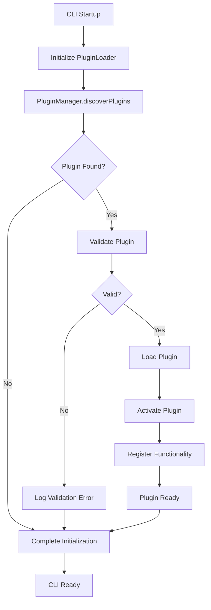

# Sistema de Plugins do Archbase CLI

O Archbase CLI oferece um sistema de plugins robusto e extensível que permite adicionar funcionalidades customizadas sem modificar o código principal da ferramenta.

## Índice

1. [Visão Geral](#visão-geral)
2. [Arquitetura do Sistema](#arquitetura-do-sistema)
3. [Descoberta e Carregamento](#descoberta-e-carregamento)
4. [Tipos de Plugins](#tipos-de-plugins)
5. [Gerenciamento de Plugins](#gerenciamento-de-plugins)
6. [Configuração e Estado](#configuração-e-estado)
7. [Segurança e Validação](#segurança-e-validação)
8. [Integração com CLI](#integração-com-cli)
9. [Exemplos de Uso](#exemplos-de-uso)

## Visão Geral

### Benefícios do Sistema de Plugins

- **Extensibilidade**: Adicione funcionalidades sem modificar o core
- **Modularidade**: Mantenha funcionalidades específicas isoladas
- **Reutilização**: Compartilhe plugins entre projetos e equipes
- **Comunidade**: Contribua para o ecossistema Archbase
- **Flexibilidade**: Configure e customize comportamentos

### Arquitetura Geral

```
📦 Archbase CLI
├── 🔧 Core System
│   ├── Generators (Form, View, Navigation, Domain)
│   ├── Commands (scan, migrate, create, etc.)
│   ├── Analyzers (ProjectScanner, RealtimeScanner)
│   └── Knowledge Base
└── 🔌 Plugin System
    ├── Plugin Manager (Discovery, Loading, Validation)
    ├── Plugin Loader (Integration Layer)
    ├── Plugin Context (API for Plugins)
    └── Plugin Commands (Management CLI)
```

## Arquitetura do Sistema

### Componentes Principais

**PluginManager**:
- Descoberta automática de plugins
- Validação de estrutura e dependências
- Carregamento e ativação dinâmica
- Gerenciamento de configuração

**PluginLoader**:
- Camada de integração com CLI principal
- Registro de funcionalidades plugin
- Resolução de conflitos
- Lifecycle management

**PluginContext**:
- API segura para plugins
- Isolamento de recursos
- Logging e configuração
- Comunicação com core

### Fluxo de Execução



## Descoberta e Carregamento

### Fontes de Plugins

**1. Plugins Locais do Projeto**:
```
./node_modules/archbase-cli-plugin-*
./.archbase/plugins/*
```

**2. Plugins Globais**:
```
$(npm root -g)/archbase-cli-plugin-*
```

**3. Plugins Built-in**:
```
<archbase-cli>/plugins/*
```

### Processo de Descoberta

```typescript
export interface PluginDiscoveryResult {
  found: PluginDescriptor[];
  errors: Array<{
    path: string;
    error: string;
  }>;
}

// Exemplo de descoberta
const discovery = await pluginManager.discoverPlugins();
console.log(`Found ${discovery.found.length} plugins`);
console.log(`Errors: ${discovery.errors.length}`);
```

### Validação de Plugins

**Estrutura Obrigatória**:
```
archbase-cli-plugin-<name>/
├── package.json         # Com nome correto e main
├── dist/index.js        # Entry point compilado
└── README.md           # Documentação
```

**package.json Requirements**:
```json
{
  "name": "archbase-cli-plugin-my-plugin",
  "main": "dist/index.js",
  "archbaseCliVersion": "^0.1.0",
  "keywords": ["archbase", "cli", "plugin"]
}
```

**Validações Aplicadas**:
- ✅ Nome inicia com `archbase-cli-plugin-`
- ✅ Arquivo `main` existe
- ✅ Estrutura de export válida
- ✅ Compatibilidade de versão
- ✅ Dependências resolvidas

## Tipos de Plugins

### 1. Generator Plugins

Adicionam novos geradores de código:

```typescript
export class CustomGenerator {
  async generate(name: string, options: any): Promise<void> {
    // Implementar geração customizada
  }
}

// Registrar no plugin
context.registerGenerator('my-component', new CustomGenerator());
```

**Uso**:
```bash
archbase generate my-component UserCard --props="name:string,age:number"
```

### 2. Command Plugins

Adicionam novos comandos CLI:

```typescript
import { Command } from 'commander';

export const customCommand = new Command('my-command')
  .description('Custom command description')
  .argument('<input>', 'Input parameter')
  .action(async (input: string, options) => {
    // Implementar lógica do comando
  });

// Registrar no plugin
context.registerCommand(customCommand);
```

**Uso**:
```bash
archbase my-command input-value --option value
```

### 3. Analyzer Plugins

Adicionam novos analisadores de projeto:

```typescript
export class CustomAnalyzer {
  async analyze(projectPath: string): Promise<AnalysisResult> {
    // Implementar análise customizada
    return {
      summary: { /* resumo */ },
      findings: [ /* descobertas */ ],
      recommendations: [ /* recomendações */ ]
    };
  }
}

// Registrar no plugin
context.registerAnalyzer('my-analyzer', new CustomAnalyzer());
```

**Integração**:
```bash
archbase scan project ./src --analyzer my-analyzer
```

### 4. Boilerplate Plugins

Adicionam novos templates de projeto:

```typescript
export class CustomBoilerplate {
  async create(projectName: string, options: any): Promise<void> {
    // Implementar criação de template
  }
}

// Registrar no plugin
context.registerBoilerplate('my-template', new CustomBoilerplate());
```

**Uso**:
```bash
archbase create project MyApp --template my-template
```

### 5. Knowledge Base Plugins

Adicionam informações sobre componentes:

```typescript
const knowledgeEntries = [
  {
    name: 'MyCustomComponent',
    category: 'custom',
    description: 'My custom component description',
    props: {
      // definições de props
    },
    examples: [
      // exemplos de uso
    ]
  }
];

// Registrar no plugin
context.registerKnowledgeBase(knowledgeEntries);
```

**Uso**:
```bash
archbase query component MyCustomComponent
```

## Gerenciamento de Plugins

### Comandos de Gerenciamento

**Listar Plugins**:
```bash
# Todos os plugins
archbase plugin list

# Apenas instalados
archbase plugin list --installed

# Formato JSON
archbase plugin list --format json
```

**Instalação**:
```bash
# Do npm registry
archbase plugin install archbase-cli-plugin-storybook

# Global
archbase plugin install archbase-cli-plugin-utils --global

# Local (.archbase/plugins)
archbase plugin install ./my-plugin --local

# Desenvolvimento
archbase plugin install . --local
```

**Desinstalação**:
```bash
# Local
archbase plugin uninstall my-plugin

# Global
archbase plugin uninstall my-plugin --global
```

**Habilitação/Desabilitação**:
```bash
# Desabilitar temporariamente
archbase plugin disable problematic-plugin

# Habilitar novamente
archbase plugin enable problematic-plugin
```

**Informações Detalhadas**:
```bash
archbase plugin info my-plugin
```

Exemplo de saída:
```
📦 archbase-cli-plugin-storybook
Version: 1.2.0
Description: Generate Storybook stories for components
Author: Community
Path: /usr/local/lib/node_modules/archbase-cli-plugin-storybook
Valid: ✅

Keywords: archbase, storybook, stories, documentation
Engine Requirements:
   node: >=16.0.0
   npm: >=8.0.0

Dependencies:
   @storybook/react: ^7.0.0
   @archbase/cli: ^0.1.0
```

### Estado dos Plugins

**Status Possíveis**:
- ✅ **Active**: Plugin carregado e funcionando
- ⏸️ **Disabled**: Plugin instalado mas desabilitado
- ❌ **Invalid**: Plugin com problemas de validação
- 🔄 **Loading**: Plugin sendo carregado
- ⚠️ **Error**: Plugin com erro durante carregamento

## Configuração e Estado

### Configuração por Plugin

**Definir Configurações**:
```bash
# Configuração simples
archbase plugin config my-plugin --set apiKey=abc123

# Configuração complexa (JSON)
archbase plugin config my-plugin --set 'options={"timeout":5000,"retries":3}'

# Configuração de endpoint
archbase plugin config my-plugin --set endpoint=https://api.example.com
```

**Consultar Configurações**:
```bash
# Valor específico
archbase plugin config my-plugin --get apiKey

# Todas as configurações
archbase plugin config my-plugin --list
```

**Exemplo de Configuração**:
```json
{
  "my-plugin": {
    "enabled": true,
    "config": {
      "apiKey": "abc123",
      "endpoint": "https://api.example.com",
      "options": {
        "timeout": 5000,
        "retries": 3
      }
    },
    "priority": 1
  }
}
```

### Acesso à Configuração no Plugin

```typescript
export default function createPlugin(): Plugin {
  return {
    async activate(context: PluginContext): Promise<void> {
      // Acessar configuração
      const config = context.getConfig('my-plugin');
      
      const apiKey = config.apiKey;
      const endpoint = config.endpoint;
      const timeout = config.options?.timeout || 3000;
      
      // Usar configuração na lógica do plugin
      if (!apiKey) {
        context.logger.warn('API key not configured');
        return;
      }
      
      // Inicializar plugin com configuração
    }
  };
}
```

### Persistência de Estado

**Localização dos Arquivos**:
```
~/.archbase/
├── config.json          # Configuração geral do CLI
├── plugins.json          # Configurações de plugins
└── cache/               # Cache de plugins
    ├── npm-packages/    # Plugins baixados do npm
    └── git-repos/       # Plugins baixados do git
```

**Formato do plugins.json**:
```json
{
  "archbase-cli-plugin-storybook": {
    "enabled": true,
    "config": {
      "outputDir": "./stories",
      "includeCSF3": true
    },
    "priority": 1
  },
  "archbase-cli-plugin-utils": {
    "enabled": false,
    "config": {},
    "priority": 2
  }
}
```

## Segurança e Validação

### Validações de Segurança

**Estrutura do Plugin**:
```typescript
interface PluginValidation {
  nameValid: boolean;        // Nome segue padrão
  mainExists: boolean;       // Entry point existe
  exportsValid: boolean;     // Exports corretos
  dependenciesResolved: boolean; // Deps disponíveis
  versionCompatible: boolean;    // Versão compatível
}
```

**Validação de Runtime**:
```typescript
// Verificação de métodos obrigatórios
if (typeof plugin.activate !== 'function') {
  throw new Error('Plugin must export activate function');
}

// Verificação de metadados
if (!plugin.metadata || !plugin.metadata.name) {
  throw new Error('Plugin must provide metadata');
}

// Verificação de compatibilidade
const requiredVersion = plugin.metadata.archbaseCliVersion;
if (!semver.satisfies(cliVersion, requiredVersion)) {
  throw new Error('Plugin incompatible with CLI version');
}
```

### Isolamento de Contexto

**PluginContext API**:
```typescript
export interface PluginContext {
  // Métodos de registro (seguros)
  registerGenerator(name: string, generator: any): void;
  registerCommand(command: Command): void;
  registerAnalyzer(name: string, analyzer: any): void;
  
  // Acesso controlado
  getConfig(pluginName: string): any;
  logger: PluginLogger;
  
  // Informações do CLI (read-only)
  cli: {
    version: string;
    rootPath: string;
    userConfigPath: string;
  };
}
```

**Limitações de Segurança**:
- ❌ Acesso direto ao filesystem fora do plugin
- ❌ Modificação de configurações de outros plugins
- ❌ Acesso a dados sensíveis do usuário
- ✅ API controlada para funcionalidades core
- ✅ Logging isolado por plugin
- ✅ Configuração isolada por plugin

### Error Handling

**Falhas de Plugin Não Afetam o CLI**:
```typescript
try {
  await plugin.activate(context);
  this.activePlugins.add(pluginName);
  this.logger.info(`Loaded plugin: ${pluginName}`);
} catch (error) {
  this.logger.error(`Failed to load plugin ${pluginName}: ${error.message}`);
  // CLI continua funcionando normalmente
}
```

**Recuperação de Erros**:
- Plugin com erro é desabilitado automaticamente
- Outros plugins continuam funcionando
- CLI core permanece estável
- Logs detalhados para debugging

## Integração com CLI

### Integração com Geradores

**PluginLoader Integration**:
```typescript
export class PluginLoader {
  getGenerators(): Map<string, any> {
    const allGenerators = new Map(this.originalGenerators);
    
    // Adicionar geradores de plugins
    const pluginGenerators = this.pluginManager.getGenerators();
    for (const [key, generator] of pluginGenerators) {
      allGenerators.set(key, generator);
    }
    
    return allGenerators;
  }
}
```

**Resolução de Conflitos**:
```typescript
// Prioridade: Core > Plugin (por ordem de carregamento)
getGenerator(name: string): any {
  // Verificar geradores core primeiro
  if (this.originalGenerators.has(name)) {
    return this.originalGenerators.get(name);
  }
  
  // Buscar em plugins
  const pluginGenerators = this.pluginManager.getGenerators();
  for (const [key, generator] of pluginGenerators) {
    if (key.endsWith(`:${name}`)) {
      return generator;
    }
  }
  
  return null;
}
```

### Integração com Comandos

**Registro Dinâmico**:
```typescript
registerPluginCommands(program: Command): void {
  const pluginCommands = this.pluginManager.getCommands();
  
  for (const [name, command] of pluginCommands) {
    try {
      program.addCommand(command);
      this.logger.debug(`Registered plugin command: ${name}`);
    } catch (error) {
      this.logger.warn(`Failed to register plugin command ${name}: ${error.message}`);
    }
  }
}
```

**Namespace de Comandos**:
- Plugins podem sobrescrever comandos existentes (com warning)
- Comandos core têm prioridade
- Conflitos de nome são logados
- Último plugin carregado tem precedência

### Integração com Knowledge Base

**Extensão de Conhecimento**:
```typescript
getKnowledgeBaseEntries(): any[] {
  const coreEntries = this.loadCoreKnowledgeBase();
  const pluginEntries = this.pluginManager.getKnowledgeBaseEntries();
  
  return [
    ...coreEntries,
    ...pluginEntries.map(entry => ({
      ...entry,
      source: entry.source, // Plugin que forneceu
      isPlugin: true
    }))
  ];
}
```

**Query com Plugins**:
```bash
archbase query component MyPluginComponent
```

Saída inclui informação do plugin:
```
📦 MyPluginComponent (from archbase-cli-plugin-custom)
   Category: custom
   Description: Custom component from plugin
   
   Props:
     • prop1: string - Description
     • prop2: number - Description
   
   Examples:
     <MyPluginComponent prop1="value" prop2={42} />
```

## Exemplos de Uso

### Cenário 1: Plugin de Storybook

**Instalação**:
```bash
archbase plugin install archbase-cli-plugin-storybook
```

**Configuração**:
```bash
archbase plugin config archbase-cli-plugin-storybook --set outputDir=./stories
archbase plugin config archbase-cli-plugin-storybook --set includeCSF3=true
```

**Uso**:
```bash
# Gerar story para componente existente
archbase generate storybook UserCard

# Gerar stories para todos componentes
archbase generate storybook --scan ./src/components
```

### Cenário 2: Plugin de Análise de Performance

**Instalação Local**:
```bash
# Desenvolvendo plugin localmente
cd ./my-performance-plugin
npm run build
archbase plugin install . --local
```

**Uso**:
```bash
# Analisar performance
archbase analyze-performance ./src --threshold 100

# Relatório detalhado
archbase analyze-performance ./src --report --output perf-report.json
```

### Cenário 3: Plugin de Geração de Documentação

**Configuração**:
```bash
archbase plugin config doc-generator --set format=markdown
archbase plugin config doc-generator --set 'includePrivate=false'
```

**Uso**:
```bash
# Gerar documentação
archbase generate docs ./src --output ./docs

# Documentação específica
archbase generate docs ./src/components/UserCard.tsx
```

### Cenário 4: Desenvolvimento de Plugin Customizado

**Criação**:
```bash
archbase plugin create my-company-generator --template generator
cd archbase-cli-plugin-my-company-generator
```

**Desenvolvimento**:
```typescript
// src/generators/ApiGenerator.ts
export class ApiGenerator {
  async generate(name: string, options: any): Promise<void> {
    const { endpoint, methods = ['GET'] } = options;
    
    // Gerar cliente de API
    const apiClient = this.generateApiClient(name, endpoint, methods);
    
    // Gerar hooks React Query
    const hooks = this.generateReactQueryHooks(name, methods);
    
    // Gerar tipos TypeScript
    const types = this.generateTypes(name);
    
    // Escrever arquivos
    await fs.writeFile(`${name}Api.ts`, apiClient);
    await fs.writeFile(`use${name}.ts`, hooks);
    await fs.writeFile(`${name}Types.ts`, types);
  }
}
```

**Instalação e Teste**:
```bash
npm run build
archbase plugin install . --local
archbase generate api UserService --endpoint=/api/users --methods=GET,POST,PUT,DELETE
```

### Cenário 5: Plugin de Integração com Ferramentas Externas

**Plugin para Figma**:
```bash
archbase plugin install archbase-cli-plugin-figma
archbase plugin config archbase-cli-plugin-figma --set token=figma-token
archbase plugin config archbase-cli-plugin-figma --set fileId=figma-file-id
```

**Uso**:
```bash
# Importar componentes do Figma
archbase import figma-component Button --frame="Desktop/Components/Button"

# Sincronizar design tokens
archbase sync figma-tokens --output ./src/theme/tokens.ts
```

### Debugging e Desenvolvimento

**Debug Mode**:
```bash
# Debug específico de plugins
DEBUG=archbase:plugin archbase plugin list

# Debug completo
DEBUG=archbase:* archbase generate my-component Test
```

**Logs de Plugin**:
```bash
# Ver logs detalhados
archbase --verbose plugin list

# Logs em tempo real
tail -f ~/.archbase/logs/plugins.log
```

**Desenvolvimento Ativo**:
```bash
# Watch mode para desenvolvimento
cd my-plugin
npm run dev

# Em outro terminal, testar mudanças
archbase plugin install . --local
archbase my-command test-input
```

O sistema de plugins do Archbase CLI oferece uma arquitetura robusta e segura para extensão da ferramenta, permitindo que desenvolvedores e equipes criem soluções específicas mantendo a estabilidade e performance do CLI principal.